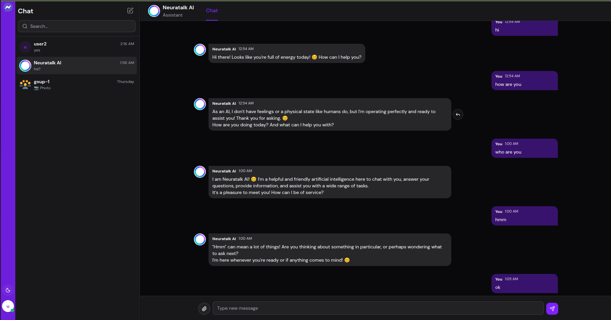
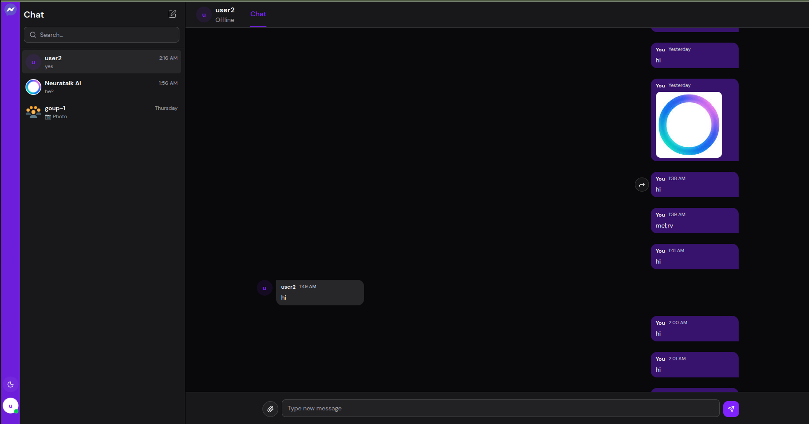
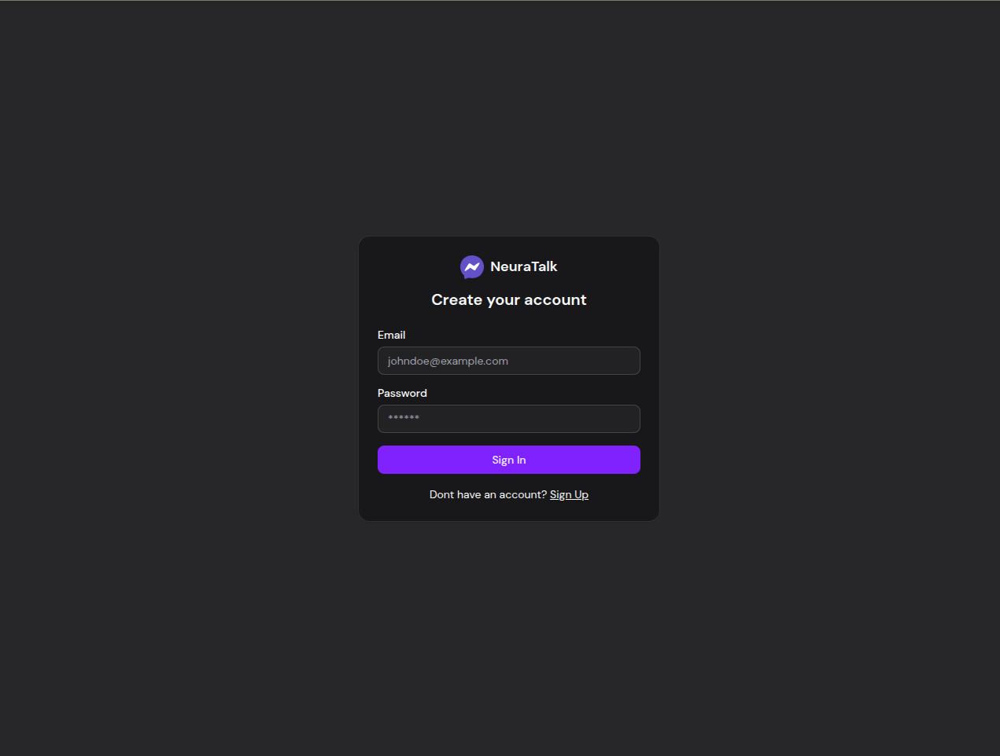

# NeuraTalk

> **NeuraTalk** is a modern real-time chat application with AI-powered conversations, built with React, Node.js, and Socket.io.

[](https://opensource.org/licenses/ISC)


<div stylr="width:100%;">

</div>

## ✨ Features

- **Real-time Messaging**: Instant messaging with WebSocket connections
- **Group Chat**: Create groups and add multiple users for collaborative conversations
- **AI-Powered Chat**: Integrated with Google Gemini AI for intelligent conversations
- **User Authentication**: Secure JWT-based authentication system
- **File Sharing**: Support for image uploads with Cloudinary integration
- **Modern UI**: Beautiful, responsive interface built with Tailwind CSS and Radix UI
- **Dark/Light Theme**: Theme switching with next-themes
- **Message Reactions**: Interactive message replies and reactions
- **Online Status**: Real-time user presence indicators
- **Typing Indicators**: See when others are typing
- **Message Status**: Delivery and read status indicators

## 🚀 Tech Stack

### Frontend
- **React 19** - Modern React with hooks and concurrent features
- **TypeScript** - Type-safe JavaScript
- **Vite** - Fast build tool and dev server
- **Tailwind CSS** - Utility-first CSS framework
- **Zustand** - Lightweight state management
- **React Router** - Client-side routing
- **Socket.io Client** - Real-time communication
- **React Hook Form** - Form handling with validation
- **Radix UI** - Accessible UI components
- **Lucide React** - Beautiful icons

### Backend
- **Node.js** - JavaScript runtime
- **Express.js** - Web framework
- **TypeScript** - Type-safe backend
- **MongoDB** - NoSQL database
- **Mongoose** - MongoDB object modeling
- **Socket.io** - Real-time bidirectional communication
- **JWT** - JSON Web Tokens for authentication
- **bcrypt** - Password hashing
- **Google AI SDK** - AI integration
- **Cloudinary** - Image hosting and optimization

## 📋 Prerequisites

Before running this application, make sure you have:

- **Node.js** (v18 or higher)
- **MongoDB** (local or cloud instance)
- **npm** or **yarn** package manager
- **Google AI API Key** (for AI features)
- **Cloudinary Account** (for image uploads)

## 🛠️ Installation

1. **Clone the repository**
   ```bash
   git clone https://github.com/den319/neuratalk.git
   cd neuratalk
   ```

2. **Install backend dependencies**
   ```bash
   cd backend
   npm install
   ```

3. **Install frontend dependencies**
   ```bash
   cd ../frontend
   npm install
   ```

4. **Environment Setup**

   **Backend (.env)**
   ```env
   PORT=5000
   NODE_ENV=development
   MONGO_URI=mongodb_uri
   JWT_SECRET=your_jwt_secret_here
   FRONTEND_ORIGIN=http://localhost:5173
   GOOGLE_GENERATIVE_AI_API_KEY=your_google_ai_api_key
   CLOUDINARY_CLOUD_NAME=your_cloudinary_cloud_name
   CLOUDINARY_API_KEY=your_cloudinary_api_key
   CLOUDINARY_API_SECRET=your_cloudinary_api_secret
   ```

   **Frontend (.env)**
   ```env
   VITE_API_URL=http://localhost:5000
   ```

## 🚀 Running the Application

### Development Mode

1. **Start the backend server**
   ```bash
   cd backend
   npm run dev
   ```

2. **Start the frontend development server**
   ```bash
   cd frontend
   npm run dev
   ```

3. **Access the application**
   - Frontend: http://localhost:5173
   - Backend: http://localhost:5000


### Production Build

1. **Build the frontend**
   ```bash
   cd frontend
   npm run build
   ```

2. **Build the backend**
   ```bash
   cd backend
   npm run build
   ```

3. **Start the production server**
   ```bash
   cd backend
   npm start
   ```

## 🖥️ UI

<table>
  <tr>
    <td width="50%" align="center">
      
      <br><b>Chat with AI</b>
    </td>
    <td width="50%" align="center">
      
      <br><b>Different Chats of User</b>
    </td>
  </tr>
  <tr>
    <td width="50%" align="center">
      
      <br><b>Sign-in Page</b>
    </td>
    
  </tr>
</table>

## 📁 Project Structure

```
neuratalk/
├── backend/
│   ├── src/
│   │   ├── config/          # Configuration files
│   │   ├── controllers/     # Route controllers
│   │   ├── lib/            # Socket.io setup
│   │   ├── middlewares/    # Express middlewares
│   │   ├── models/         # MongoDB models
│   │   ├── routes/         # API routes
│   │   ├── services/       # Business logic
│   │   ├── utils/          # Utility functions
│   │   ├── validators/     # Input validation
│   │   └── index.ts        # Server entry point
│   ├── dist/               # Compiled JavaScript
│   └── package.json
├── frontend/
│   ├── src/
│   │   ├── components/     # React components
│   │   ├── hooks/          # Custom React hooks
│   │   ├── layouts/        # Layout components
│   │   ├── lib/            # Utility functions
│   │   ├── pages/          # Page components
│   │   ├── routes/         # Routing configuration
│   │   ├── types/          # TypeScript types
│   │   └── App.tsx         # Main app component
│   ├── public/             # Static assets
│   ├── dist/               # Built files
│   └── package.json
└── README.md
```

## 🔧 API Endpoints

### Authentication
- `POST /api/auth/register` - User registration
- `POST /api/auth/login` - User login
- `GET /api/auth/me` - Get current user

### Chats
- `GET /api/chat/all` - Get all user chats
- `POST /api/chat/create` - Create new chat
- `GET /api/chat/:id` - Get chat details

### Messages
- `POST /api/chat/message/send` - Send message

### Users
- `GET /api/user/all` - Get all users

## 🌐 WebSocket Events

### Client to Server
- `chat:join` - Join a chat room
- `chat:leave` - Leave a chat room
- `typing` - Send typing indicator
- `remove:typing-user` - Remove typing indicator

### Server to Client
- `message:new` - New message in chat
- `chat:update` - Chat information updated
- `chat:ai` - AI response (streaming or complete)
- `online:users` - List of online users
- `typing:users` - Users currently typing

## 🤖 AI Integration

NeuraTalk integrates with Google Gemini AI to provide intelligent chat responses. The AI features include:

- **Context-aware responses** based on chat history
- **Streaming responses** for real-time text generation
- **Image analysis** capabilities
- **Multi-modal conversations** (text + images)

## 📱 Features Overview

### Real-time Chat
- Instant message delivery with WebSocket
- Message read receipts and status indicators
- Typing indicators
- Online presence status

### AI Conversations
- Chat with AI assistant powered by Google Gemini
- Streaming responses for smooth UX
- Context preservation across messages
- Image understanding capabilities

### User Interface
- Modern, responsive design
- Dark and light theme support
- Mobile-friendly interface
- Intuitive navigation

### Security
- JWT-based authentication
- Password hashing with bcrypt
- CORS protection
- Helmet security headers

## 🚀 Deployment

### Environment Variables for Production

**Backend:**
```env
NODE_ENV=production
PORT=5000
MONGO_URI=your_mongodb_connection_string
JWT_SECRET=your_secure_jwt_secret
FRONTEND_ORIGIN=https://yourdomain.com
GOOGLE_GENERATIVE_AI_API_KEY=your_google_ai_key
CLOUDINARY_CLOUD_NAME=your_cloudinary_name
CLOUDINARY_API_KEY=your_cloudinary_key
CLOUDINARY_API_SECRET=your_cloudinary_secret
```

**Frontend:**
```env
VITE_API_URL=https://your-backend-url.com
```

### Build Commands

```bash
# Install dependencies and build
npm install --include=dev --prefix frontend && npm run build --prefix frontend
npm install --include=dev --prefix backend && npm run build --prefix backend

# Start production server
npm start --prefix backend
```

## 🧪 Testing

```bash
# Run frontend tests
cd frontend
npm run lint

# Run backend type checking
cd backend
npm run build
```

## 🤝 Contributing

1. Fork the repository
2. Create a feature branch (`git checkout -b feature/amazing-feature`)
3. Commit your changes (`git commit -m 'Add amazing feature'`)
4. Push to the branch (`git push origin feature/amazing-feature`)
5. Open a Pull Request

## 📝 License

This project is licensed under the ISC License - see the [LICENSE](LICENSE) file for details.

## 🙏 Acknowledgments

- [Google AI](https://ai.google.dev/) for the Gemini AI integration
- [Socket.io](https://socket.io/) for real-time communication
- [Tailwind CSS](https://tailwindcss.com/) for styling
- [Radix UI](https://www.radix-ui.com/) for accessible components
